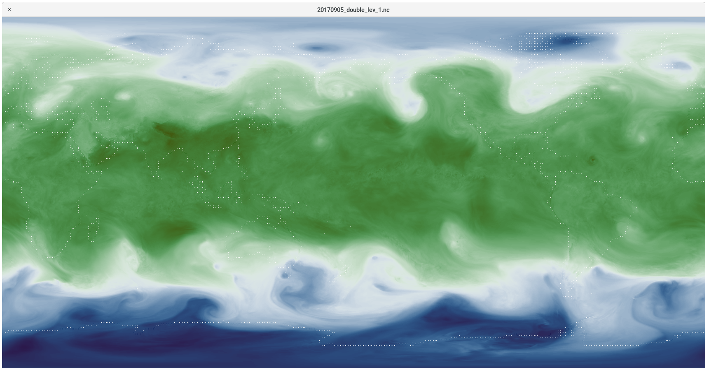

# Scientific colour maps for Ncview

Fabio Crameri's [colour maps](http://www.fabiocrameri.ch/colourmaps.php) adapted for Ncview.



## Usage

According to the Ncview source code:

```
ncview has a useful set of built-in colormaps.  The set of built-in
colormaps can be augmented by user-specified colormaps that are contained
in simple ASCII files with 256 lines, where each line has 3 entries
(separated by spaces), which indicate the R, B, and G values.  Each value
must be an integer between 0 and 255, inclusive.  User-specified
colormaps are contained in files with the extension of ".ncmap", and can
live in the following places:
 1) NCVIEW_LIB_DIR, which is determined at installation time.	A
   reasonable choice is "/usr/local/lib/ncview".
 2) In a directory named by the environmental variable "NCVIEWBASE".
 3) If there is no environmental variable "NCVIEWBASE", then in $HOME.
 4) In the current working directory.
```

So the easiest way is to clone this repository, and then export its path as the environment variable `$NCVIEWBASE`:

```bash
export NCVIEWBASE=/path/to/ncview-scientific-colour-maps
```

Then when you open Ncview it should automatically have all of the colourmaps available.
